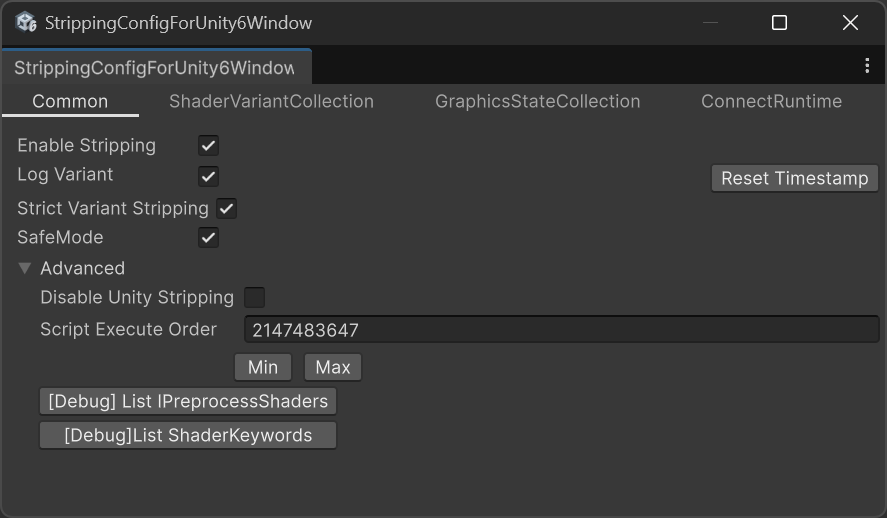
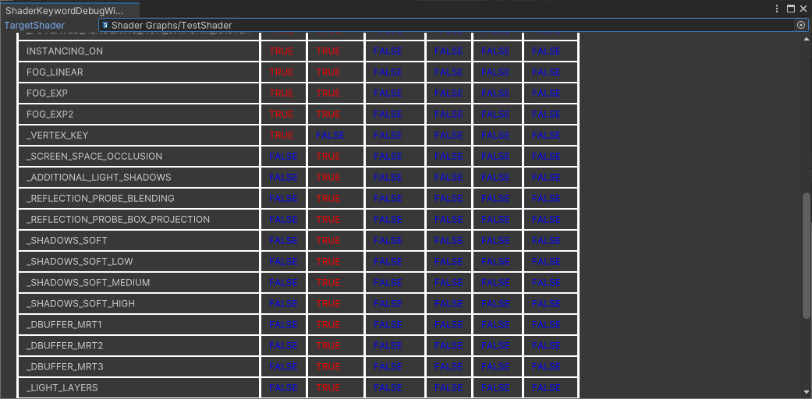
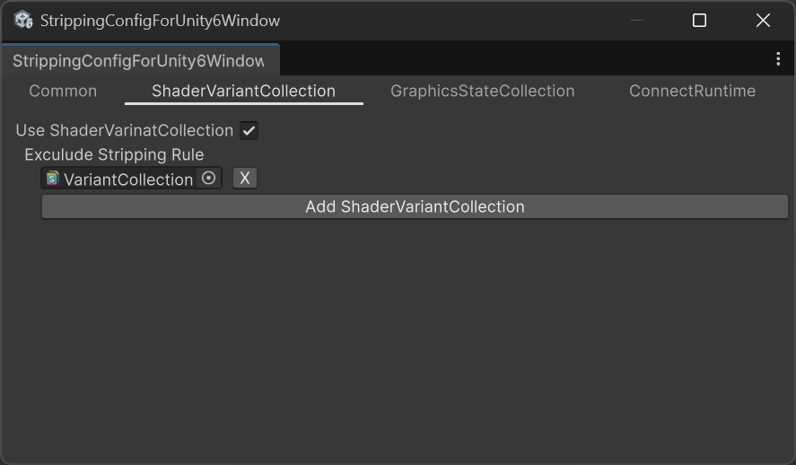
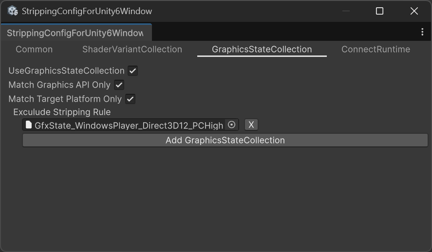
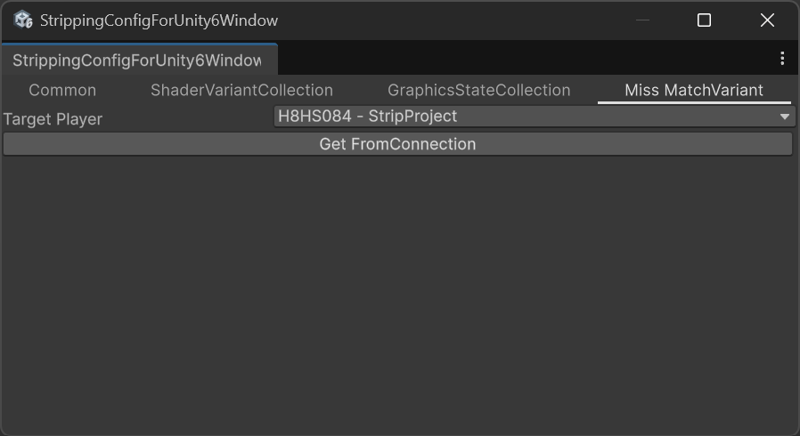

# StrippingByVariantCollection

プロジェクト内にあるShaderVariantCollection及びGraphicsStateCollectionを探してきて、登録されていないVariantをビルドから除外します。 
メニューの「UTJ/ShaderVariantStrip」の設定ウィンドウを変更することが出来ます。 

# Unity 2022までをお使いの場合
[version 2](https://github.com/wotakuro/StrippingByVariantCollection/tree/version2)をお使いください

# 設定画面について
## Commonタブ

### Enable Stripping
Strip処理を行うかどうかを指定します。

### Log Variants
ビルドした時に、どのバリアントを入れて、どのバリアントを除外したか？をログとして残すかを指定します。 
プロジェクト直下の「ShaderVariants/Builds/タイムスタンプ」ディレクトリ以下に書き出します。 
これはStrippingが無効でもログ書き出しすることが可能です。

### 「Reset Timestamp」ボタン
連続でビルドする際に、ログのタイムスタンプがうまくリセットされない可能性があったため用意しました。 
連続ビルド時にログのタイムスタンプが上手く更新されないことがあったら押してください。

### Strict Variant Stripping
有効になった時は ShaderVariantCollection/GraphisStateCollectionにないShaderは全Variant削除を行います。 
無効の場合は、ShaderVariantCollection/GraphisStateCollectionにないShaderは特に特別なStrip処理は行いません。

### SafeMode
もしPass内の全てのVariantが削除されてしまうケースに遭遇した場合、最低でも一つはVariantを残すようにします。 
Passが空となってしまうとFallbackされず描画がスキップされてしまうのでオプションを用意しました。

### Disable Unity Stripping
有効にすることで、「UnityEngine.」「Unity.」 以下にある IPreprocessShadersの処理を消します。(Universal RenderPipelineにあるものを無効にするなど出来ます) 
Strict Variant Strippingが有効になっていないと、こちらの機能は使う事が出来ません。 
※IL書き換えによって実現します

### Script Execute Order
本アセットのIPreprocessShadersのorder(実行順) を指定します。

### [Debug] List IPreprocessShaders
IPreprocessShadersを実装した全てのクラスを表示します。

### [Debug]List ShaderKeywords

Shaderのキーワードが、どのStageで有効になっているかデバッグするための機能です。

## ShaderVariantCollection タブ

### Use ShaderVariantCollection
無効にすると、プロジェクト内にあるShaderVariantCollectionを考慮しないようになります。

### Exclude Stripping Rule
ここで指定されたShaderVariantCollectionアセットは対象外となり、無視します。

## GraphicsStateCollection タブ

### UseGraphicsStateCollection
無効にすると、プロジェクト内にあるGraphicsStateCollectionを考慮しないようになります。

### Match Graphis API Only
ビルド対象と同じGraphicsAPIで作成されたGraphicsStateCollectionのみを考慮するようにします

### Match Target Platfomr Only
ビルド対象と同じPlatformで作成されたGraphicsStateCollectionのみを考慮するようにします

### Exclude Stripping Rule
ここで指定されたGraphicsStateCollectionアセットは対象外となり、無視します。

## Miss MathVariantタブ
  
PlayerSettingsの「Strict shader variant matching 」を有効にしたDevelopmentBuildから、ミスマッチが起きたShaderVariantを収集して、ダミーのGraphicsStateCollectionを作るためのオプションです。

### TargetPlayer
DevelopmentBuildした対象を指定します。

### GetFrom Connection
このボタンを押すと、Assets/MissMatchVarint以下にGraphicsStateCollectionを生成します。

 

# 参考情報
## Strip処理について
こちらはスクリプタブルシェーダーバリアントの除去を使っています 
https://blogs.unity3d.com/jp/2018/05/14/stripping-scriptable-shader-variants/
