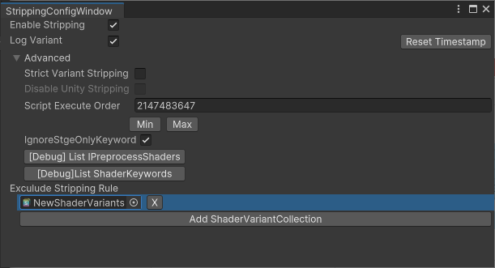

# StrippingByVariantCollection

プロジェクト内にあるShaderVariantCollectionを探してきて、登録されていないVariantをビルドから除外します。 
メニューの「UTJ/ShaderVariantStrip」の設定ウィンドウを変更することが出来ます。 

## 設定画面について

### Enable Stripping
Strip処理を行うかどうかを指定します。

### Log Variants
ビルドした時に、どのバリアントを入れて、どのバリアントを除外したか？をログとして残すかを指定します。 
プロジェクト直下の「ShaderVariants/Builds/タイムスタンプ」ディレクトリ以下に書き出します。 
これはStrippingが無効でもログ書き出しすることが可能です。

## 「Reset Timestamp」ボタン
連続でビルドする際に、ログのタイムスタンプがうまくリセットされない可能性があったため用意しました。
連続ビルド時にログのタイムスタンプが上手く更新されないことがあったら押してください。

### Strict Variant Stripping
有効になった時は ShaderVariantCollectionにないShaderは全Variant削除を行います。
無効の場合は、ShaderVariantCollectionにないShaderは特に特別なStrip処理は行いません。

### DisableOther Stripping
有効にすることでUniversal RenderPipelineなど 他のIPreprocessShadersの処理を消します。 
Strict Variant Strippingが有効になっていないと、こちらの機能は使う事が出来ません。 
※IL書き換えによって実現します

### Script Execute Order
本アセットのIPreprocessShadersのorder(実行順) を指定します。

### Exclude Stripping Rule
ここで指定されたShaderVariantCollectionアセットは対象外となり、無視します。

 

参考：
こちらはスクリプタブルシェーダーバリアントの除去を使っています 
https://blogs.unity3d.com/jp/2018/05/14/stripping-scriptable-shader-variants/
